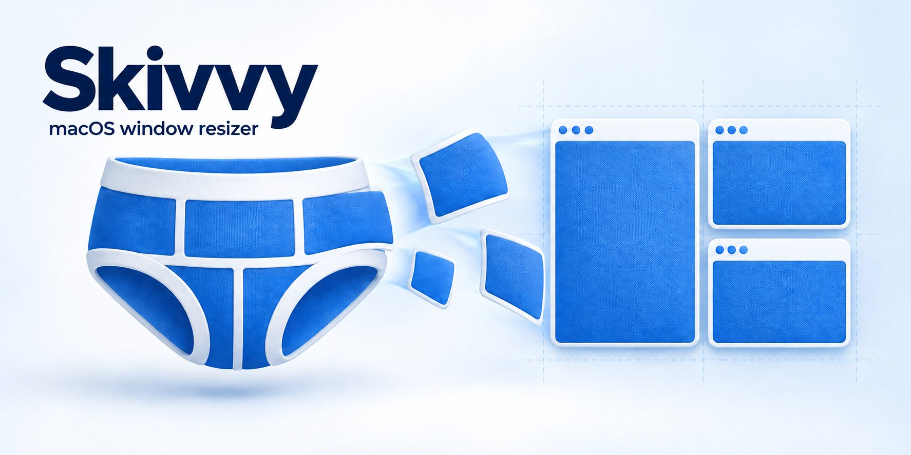
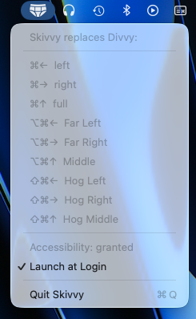

<p align="center">
  
</p>

# Skivvy

A skinny Divvy. Skivvy is a tiny macOS menu bar utility that moves and
resizes the frontmost window into column layouts with nine global
keyboard shortcuts. Apple Silicon only, macOS 26 or later.

<p align="center">
  
</p>

## What it is

Six equal columns across the screen. Nine shortcuts, each of which
snaps the current window to a span of those columns at full height,
flush against the edges. Press the same shortcut again and the window
moves to the same layout on the next display.

| Shortcut | Name       | Columns | Width             |
|----------|------------|---------|-------------------|
| ⌘←       | left       | 1–3     | left half         |
| ⌘→       | right      | 4–6     | right half        |
| ⌘↑       | full       | 1–6     | full width        |
| ⌥⌘←      | Far Left   | 1–2     | left third        |
| ⌥⌘→      | Far Right  | 5–6     | right third       |
| ⌥⌘↑      | Middle     | 3–4     | center third      |
| ⇧⌘←      | Hog Left   | 1–4     | left two-thirds   |
| ⇧⌘→      | Hog Right  | 3–6     | right two-thirds  |
| ⇧⌘↑      | Hog Middle | 2–5     | center two-thirds |

⌘ is halves, ⌥⌘ is thirds, ⇧⌘ is two-thirds. Left arrow anchors left,
right arrow anchors right, up arrow is full or centered.

There is no preferences window. The menu shows the shortcuts, the
Accessibility status, a Launch at Login toggle, and Quit.

## Why you would want it

Divvy did this job for over a decade and was abandoned as an Intel
binary. macOS 27 is the last release that runs Intel apps through
Rosetta, and macOS 28 drops it. Every replacement on the market asks
for the Accessibility permission, which lets an app read and control
the interface of every other app on your Mac and observe every
keystroke. That is a lot to hand to software you cannot read.

Skivvy is the smallest thing that does the job, and you can read all
of it:

- The shortcuts use Carbon hotkeys. They need no permission at all,
  they never see any other keystroke, and the frontmost app never
  receives the key, so ⌘← does not also move your text cursor.
- Exactly two source files touch the Accessibility API, and the only
  calls are reading and writing position and size on the focused
  window.
- No network, no analytics, no updater, no configuration file.

If you build it yourself, the binary on your Mac came from your Mac.

## How to customize it

The layouts and key combinations are hard coded in one file:
`Skivvy/SkivvyCore/Sources/SkivvyCore/Layout.swift` and its neighbor
`Hotkey.swift`. Change them there, rebuild, reinstall.

**Column spans** are in `Layout.columns`. Columns are 0-indexed and
inclusive, so `0...2` is the left half of six columns:

```swift
case .left: 0...2
case .right: 3...5
```

**Number of columns** is `Layout.columnCount`. Set it to 4 for
quarters and adjust the spans to match.

**Key combinations** are in `Hotkey.swift`. Each layout picks an arrow
key and a modifier set:

```swift
var keyCode: UInt32 {
    switch self {
    case .left, .farLeft, .hogLeft: Hotkey.leftArrow
    ...
```

```swift
var modifiers: Set<Hotkey.Modifier> {
    switch self {
    case .left, .right, .full: [.command]
    case .farLeft, .farRight, .middle: [.command, .option]
    case .hogLeft, .hogRight, .hogMiddle: [.command, .shift]
```

Other keys work too. Use the macOS virtual key code, for example
`0x7D` for the down arrow, and any combination that includes ⌘, ⌥,
⇧, or ⌃. Combinations with only ⌥ or only ⇧⌥ are refused by macOS.

**Adding or removing layouts** means editing the `Layout` enum cases
and the three `switch` statements that map each case to its columns,
name, and hotkey. The menu and the hotkey registration both read from
that enum, so nothing else changes.

Run `Shell/test.sh` after editing. The tests check that the columns
tile the screen exactly, that every layout is full height, and that
the nine hotkeys are distinct.

## How to build it

Requires Xcode 27 on an Apple Silicon Mac. Everything works from the
terminal; you never need to open the Xcode GUI.

```
git clone https://github.com/mikerandrup/Skivvy.git
cd Skivvy
Shell/build.sh Release
```

The script prints the path of the built `Skivvy.app`. For a Debug
build that launches immediately, use `Shell/run.sh`.

The project signs with an Apple Development identity through
automatic signing. If you are not on the original team, set your own
team in the target's Signing settings, or in
`Skivvy/Skivvy.xcodeproj/project.pbxproj` under `DEVELOPMENT_TEAM`.
A free personal team is enough. Do not use Sign to Run Locally: an ad
hoc signature changes on every build and macOS silently forgets the
Accessibility grant each time.

## How to install it

```
Shell/install.sh
```

That builds Release, replaces `/Applications/Skivvy.app` atomically,
and launches it. Then:

1. Click Allow on the Accessibility prompt, or turn Skivvy on under
   System Settings > Privacy & Security > Accessibility. The app polls
   for the grant, so there is no need to relaunch.
2. Open the Skivvy menu and turn on Launch at Login.

Do both from the installed copy in `/Applications`, not from a build
inside Xcode's DerivedData, so the login item points at a stable path.

If you received a prebuilt copy rather than building it, macOS will
refuse the first launch because the app is not notarized. Go to
System Settings > Privacy & Security and click Open Anyway, once.

## Development notes

```
Shell/build.sh [Debug|Release]  # xcodebuild, prints the app path
Shell/run.sh                    # build Debug, quit any Skivvy, launch
Shell/test.sh                   # swift test in SkivvyCore
Shell/logs.sh --last 5m         # Skivvy's unified log
Shell/reset-accessibility.sh    # clear the TCC grant to re-test the prompt
Shell/install.sh                # Release build to /Applications
```

The app target is deliberately thin. All logic lives in the
`SkivvyCore` Swift package so it can be unit tested with Swift Testing
and `swift test`:

- `Layout` and `Hotkey`: the table above.
- `Geometry.flip`: converts between NSScreen space and Accessibility
  space, anchored to the primary screen only.
- `Screens` and `Resolver`: which display a window is on, and whether
  a repeat press should walk it to the next one.
- `AXElement`, `AXWindow`, `WindowMover`: the only code that touches
  the Accessibility API. Writes size, then position, then size again
  because macOS clamps size to the window's current display, and
  suppresses `AXEnhancedUserInterface` during the write so animating
  apps land where asked.

`Shell/test.sh` also runs an integration suite that drives a real
TextEdit window through all nine layouts. It self-skips unless the
terminal running it has the Accessibility grant.

Research on macOS 26 and 27 behavior, with sources, is in `_notes/`.

<p align="center">
  
</p>

## Known limits

- Fullscreen windows are skipped.
- Under Stage Manager only the on-stage focused window is managed.
- Apps with a minimum width wider than a column keep their minimum and
  are clamped inside the destination screen at the target column.
- It cannot be sold or given away on the Mac App Store. Store apps must
  be sandboxed, and sandboxed apps cannot use the Accessibility API.
